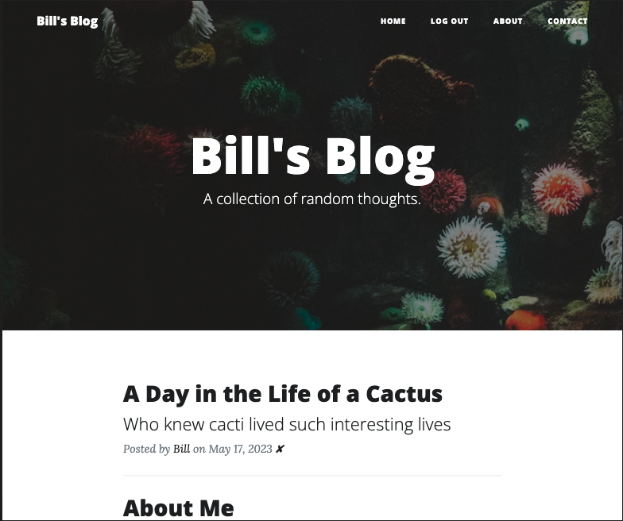
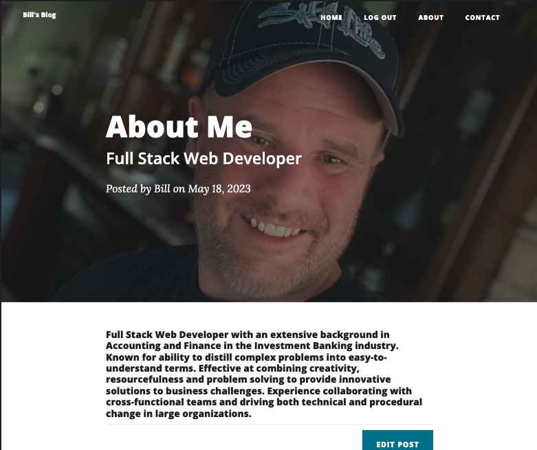
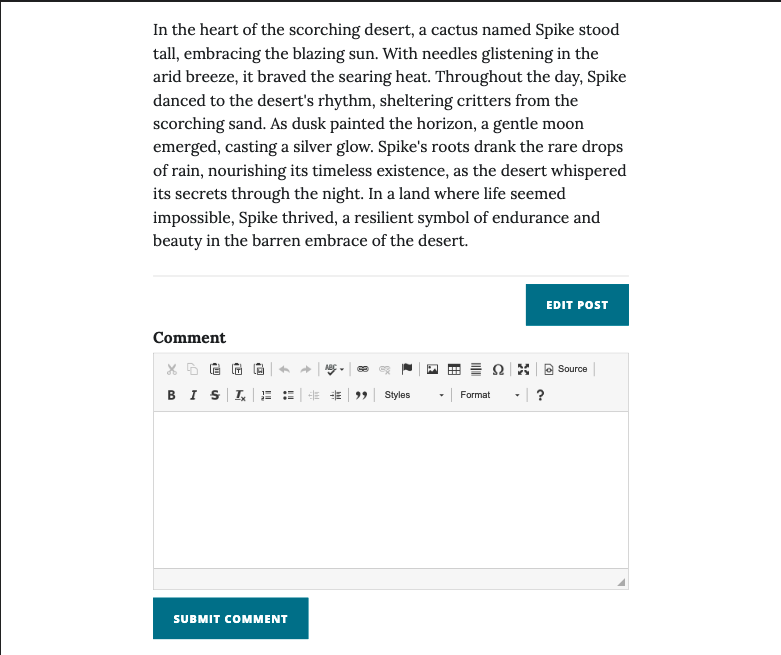

# Blog-Python-Flask 

  ## Description

  This is a full stack Blog application built using the Python Flask framework, Jinja templating, SQLite, SQLAlchemy, WTForms, and Flask 
  Login for user authentication.

Screenshots below:

  
  ## Table of Contents
  
  - [Installation](#installation)
  - [Usage](#usage)
  - [License](#license)
  - [Contributing](#contributing)
  - [Tests](#tests)
  - [Questions](#questions)
  
  ## Installation
  
  deployed url:  https://bill-blog-python-flask.herokuapp.com/
  
  ## Usage
  
  go to deployed url above, users can register to review posts and comment on posts.  Admin users are able to create, 
  edit, and delete posts.

  ## License
This application is covered under the MIT License.
 For more information: https://opensource.org/licenses/MIT
  
  ## Contributing
  N/A
  
  ## Tests
  N/A

  ## Questions
  Contact Info 
  GitHub user name: BillStephens2022 
  Link to GitHub profile: https://github.com/BillStephens2022 
  Email: stephensbill17@gmail.com
